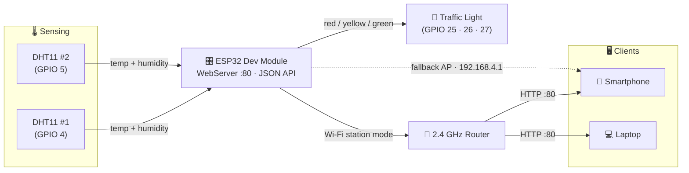
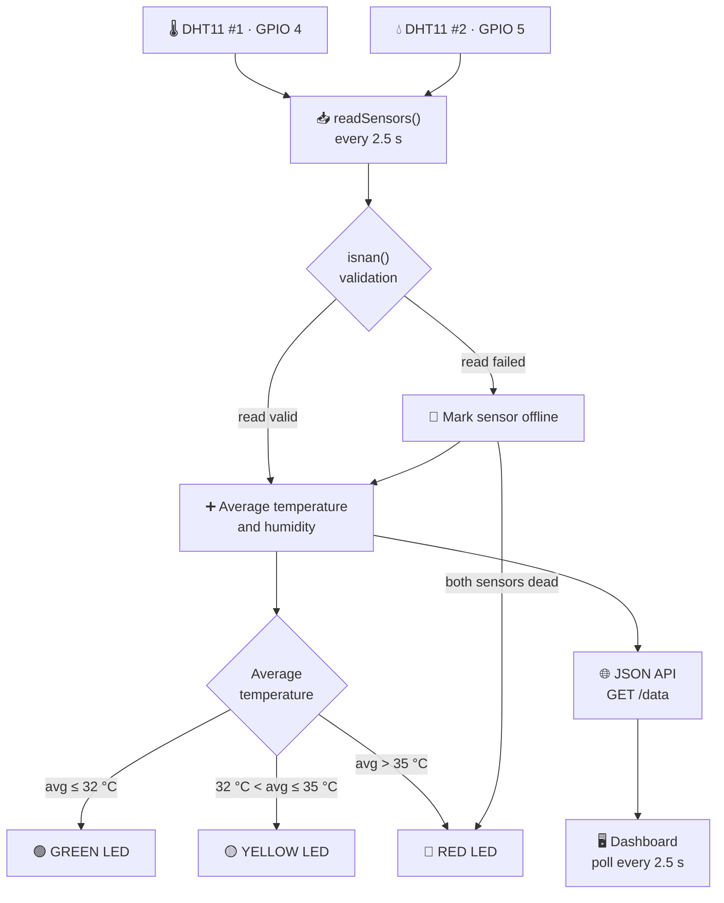

<div align="center">

```text
███████╗███╗   ███╗ █████╗ ██████╗ ████████╗    ██████╗  ██████╗  ██████╗ ███╗   ███╗
██╔════╝████╗ ████║██╔══██╗██╔══██╗╚══██╔══╝    ██╔══██╗██╔═══██╗██╔═══██╗████╗ ████║
███████╗██╔████╔██║███████║██████╔╝   ██║       ██████╔╝██║   ██║██║   ██║██╔████╔██║
╚════██║██║╚██╔╝██║██╔══██║██╔══██╗   ██║       ██╔══██╗██║   ██║██║   ██║██║╚██╔╝██║
███████║██║ ╚═╝ ██║██║  ██║██║  ██║   ██║       ██║  ██║╚██████╔╝╚██████╔╝██║ ╚═╝ ██║
╚══════╝╚═╝     ╚═╝╚═╝  ╚═╝╚═╝  ╚═╝   ╚═╝       ╚═╝  ╚═╝ ╚═════╝  ╚═════╝ ╚═╝     ╚═╝
```

### 🏠 ESP32 · DHT11 · IoT · TEMPERATURE · HUMIDITY · LIVE DASHBOARD 🏠

</div>

<br>

```text
      🏠  SMART ROOM — SYSTEM OVERVIEW

               🌡 DHT11 #1                     🌡 DHT11 #2
                    │                               │
                    ┌────────────┬──────────────────┐
                                 │
                                 ▼
                        ┌─────────────────┐
                        │                 │
                        │      ESP32      │   ──►  📶 2.4 GHz Wi-Fi
                        │                 │
                        └────────┴────────┘
                                 │
                                 ▼
                        ┌─────────────────┐
                        │🚦 TRAFFIC LIGHT │
                        └─────────────────┘

  DHT11 #1 → GPIO 4    ·    DHT11 #2 → GPIO 5
  Both sensors share  VCC → 3.3 V  and  GND → common ground
```

<br>

<p align="center">
  
  
  
  
  
  
</p>

<p align="center">
  
  
  
  
  
  
</p>

---

> ### 🌡️ *A compact, local-first IoT Smart Room Monitor that turns an ESP32 into a real-time environmental station — dual DHT11 sensors, a traffic-light LED status indicator, and a live mobile-friendly web dashboard, all running on your own Wi-Fi.*

---

## 📋 Table of Contents

| | | |
|---|---|---|
| [🌡️ About This Project](#about-this-project) | [🧠 System Architecture](#system-architecture) | [🔄 Data Flow](#data-flow) |
| [🚀 Features](#features) | [🔌 Hardware](#hardware-components) | [🧵 Wiring & Pinout](#wiring-and-pinout) |
| [🚦 Traffic Light Logic](#traffic-light-logic) | [🎬 Startup Animation](#startup-animation) | [📶 Wi-Fi Mode](#wi-fi-mode) |
| [📴 Offline AP Mode](#offline-access-point-mode) | [🌐 Web Dashboard](#web-dashboard) | [⚙️ Installation](#installation) |
| [🗂️ Project Structure](#project-structure) | [💻 Firmware](#firmware) | [🛠️ Troubleshooting](#troubleshooting) |

---

## 🌡️ About This Project

**What it does** — The **ESP32 Smart Room Monitor** is an IoT environmental monitoring system that continuously measures **temperature** and **humidity** from **two DHT11 sensors**, computes the room average, and reflects the comfort level with a **traffic-light LED module** (🟢 comfortable → 🟡 warm → 🔴 hot). The ESP32 runs its own **web server** and serves a live, auto-refreshing dashboard over **2.4 GHz Wi-Fi** — no cloud, no phone app, no subscription required.

**Why it was built** — To demonstrate a complete, self-contained IoT loop on real hardware: **sense → process → act → serve**. It is an ideal learning project for students and hobbyists moving from blinking LEDs toward networked embedded systems, because every classic IoT concept appears in one small build:

| IoT Concept | How this project does it |
|---|---|
| 🎛️ **Embedded computing** | ESP32 Dev Module reads both sensors every 2.5 s |
| 🌡️ **Sensing** | Two DHT11s measure temperature + humidity from different spots |
| 🧮 **Data processing** | Sensor validation (`isnan`) + averaging + threshold classification |
| 🚦 **Acting** | Traffic-light LEDs give an instant visual room-status readout |
| 📶 **Networking** | Connects to your router, or creates its own fallback access point |
| 🌐 **Interfacing** | Embedded web server with an HTML/CSS/JS dashboard + JSON API |

**Why two sensors?** One sensor only tells you about *its corner* of the room. Two sensors placed apart give a more honest picture — the firmware averages them, and if one sensor ever fails, the system gracefully keeps running on the healthy one (the dashboard marks the dead sensor as offline).

**Why useful as an IoT project** — Everything happens on-device and on your local network: instant page loads, full privacy, works even when the internet is down (fallback AP mode), and it costs a few dollars in parts. It is also easy to extend later — add MQTT, logging, a buzzer, or cloud sync.

---

## 🚀 Features

| | Feature | Description |
|---|---|---|
| 🌡️ | **Dual temperature monitoring** | Independent readings from DHT11 #1 (GPIO 4) and DHT11 #2 (GPIO 5) |
| 💧 | **Humidity monitoring** | Relative humidity captured alongside each temperature sample |
| ➗ | **Smart averaging** | Room average computed from both sensors — auto-falls back to a single healthy sensor |
| 🚦 | **Traffic-light status** | Green / yellow / red LEDs map the average temperature to a comfort level |
| 📶 | **2.4 GHz Wi-Fi** | Connects to your home router (station mode) with auto-reconnect |
| 🌐 | **Live web dashboard** | Mobile-friendly HTML/CSS/JS dashboard, polling fresh data every 2.5 s |
| ⚡ | **JSON API** | `GET /data` returns clean JSON for your own clients or integrations |
| 🔗 | **mDNS hostname** | Reach the device at `http://smartroom.local` instead of an IP |
| 📴 | **Offline AP fallback** | No router? The ESP32 becomes `ESP32-SmartRoom` — dashboard still works |
| 🔄 | **Auto sensor refresh** | Both sensors re-read and LEDs re-evaluated every 2.5 seconds |
| 🎬 | **Startup animation** | Red → yellow → green boot sequence on power-up |
| 📱 | **Mobile-friendly UI** | Responsive glassmorphism-style cards on any phone or laptop browser |

---

## 🧠 System Architecture



| Layer | Component | Role |
|---|---|---|
| 🌡️ **Sensing** | DHT11 #1 · #2 | Digital temperature & humidity on GPIO 4 / GPIO 5 |
| 🧠 **Processing** | ESP32 firmware | Validation → averaging → threshold classification |
| 🚦 **Actuation** | Traffic light module | GPIO 25 / 26 / 27 visual status output |
| 🌐 **Serving** | WebServer + JSON API | Dashboard on `/`, live data on `/data` |
| 📶 **Connectivity** | Wi-Fi STA / AP | Router connection, or self-hosted fallback network |

---

## 🔄 Data Flow



The loop runs forever inside `loop()`: read sensors (if 2.5 s elapsed) → validate → average → classify → drive LEDs, while the web server handles dashboard + API requests in parallel.

---

## 🔌 Hardware Components

| # | Component | Qty | Purpose |
|---|---|---|---|
| 1 | **ESP32 Dev Module** | 1 | Main microcontroller — sensing, logic, LEDs, web server, Wi-Fi |
| 2 | **DHT11 sensor** | 2 | Digital temperature (°C) and humidity (%) measurement |
| 3 | **Traffic-light LED module** | 1 | Green / yellow / red status indication |
| 4 | **Breadboard** | 1 | No-solder prototyping base for all connections |
| 5 | **Jumper wires** | ~12 | M2M / M2F wiring between sensors, LEDs and the ESP32 |
| 6 | **USB data cable** | 1 | Power + firmware upload (must support *data*, not charge-only) |

> 💰 **Total cost:** roughly the price of a coffee — an ideal first "real IoT" build.

---

## 🧵 Wiring and Pinout

### Pinout table

| Component | Pin | Connect to |
|---|:---:|:---:|
| DHT11 #1 | VCC | ESP32 **3.3 V** |
| DHT11 #1 | DATA | ESP32 **GPIO 4** |
| DHT11 #1 | GND | ESP32 **GND** |
| DHT11 #2 | VCC | ESP32 **3.3 V** |
| DHT11 #2 | DATA | ESP32 **GPIO 5** |
| DHT11 #2 | GND | ESP32 **GND** |
| Traffic light | RED | ESP32 **GPIO 25** |
| Traffic light | YELLOW | ESP32 **GPIO 26** |
| Traffic light | GREEN | ESP32 **GPIO 27** |
| Traffic light | GND | ESP32 **GND** |

> ⚠️ **Important:** Power both DHT11s from **3.3 V** (never 5 V), keep all **GND** rails common, and remember the ESP32 logic level is **3.3 V**.

### Wiring diagram

```text
   DHT11 #1  · VCC ─────────────────────►  3.3 V
   DHT11 #1  · DATA ────────────────────►  GPIO 4
   DHT11 #1  · GND ─────────────────────►  GND

   DHT11 #2  · VCC ─────────────────────►  3.3 V
   DHT11 #2  · DATA ────────────────────►  GPIO 5
   DHT11 #2  · GND ─────────────────────►  GND

   Traffic   · RED ─────────────────────►  GPIO 25
   Traffic   · YELLOW ──────────────────►  GPIO 26
   Traffic   · GREEN ───────────────────►  GPIO 27
   Traffic   · GND ─────────────────────►  GND
```

> 📷 **Visual reference** — replace `assets/wiring-diagram.png` with a photo or Fritzing-style schematic of your actual build:


---

## 🚦 Traffic Light Logic

The dashboard status is always driven by the **average temperature** of the healthy sensors:

| Average temperature | Status | LED | Meaning |
|---|:---:|:---:|---|
| `≤ 32 °C` | 🟢 **Comfortable** | **GREEN** | Room temperature is comfortable |
| `32 °C < avg ≤ 35 °C` | 🟡 **Warm** | **YELLOW** | Room is getting warm |
| `> 35 °C` | 🔴 **Hot** | **RED** | Room temperature is high |

Special cases handled in firmware:

- 🟢➡️🟡➡️🔴 **One sensor offline** — the average falls back to the single working sensor, and the traffic light keeps working normally.
- 🔴 **Both sensors offline** — a read failure keeps returning `NaN`, so the traffic light shows **RED** as an explicit "sensor error" state (never a silent wrong answer).

```cpp
if (!sensor1OK && !sensor2OK) { redLight(); return; }

if (averageTemp <= GREEN_LIMIT)        greenLight();   // ≤ 32 °C
else if (averageTemp <= YELLOW_LIMIT)  yellowLight();  // ≤ 35 °C
else                                   redLight();     // > 35 °C
```

---

## 🎬 Startup Animation

Every power-up plays a self-test light sequence so you can confirm all three LED channels are wired correctly:

```text
        ┌───────────────┐
        │  SYSTEM BOOT  │
        └───────┬───────┘
                │
                ▼
        🔴 RED LED FLASH
                │
                ▼
       🟡 YELLOW LED FLASH
                │
                ▼
       🟢 GREEN LED FLASH
                │
                ▼
         🚦 SEQUENCE × 3
                │
                ▼
       📶 CONNECT TO WI-FI
                │
        ┌───────┬───────┐
           ▼          ▼
        SUCCESS    FAILED
           │          │
           ▼          ▼
       🟢 STEADY 🟡 AP MODE
         GREEN    (OFFLINE)
```

| Phase | LED behavior |
|---|---|
| Boot self-test | Red → yellow → green flash, 3 cycles × 180 ms each |
| Connecting to Wi-Fi | Yellow LED **blinks** (500 ms toggle) |
| Wi-Fi connected | Green LED **steady** |
| Connection lost / fallback AP active | Yellow LED **steady** |
| Both sensors unreadable | Red LED **steady** (sensor error) |

---

## 📶 Wi-Fi Mode

The ESP32 runs as a **Wi-Fi station** on your **2.4 GHz** network:

1. ESP32 boots and runs the startup LED animation.
2. It connects to your router using the SSID/password compiled into the firmware.
3. It grabs an **IP address** from the router (printed to the Serial Monitor @ 115200 baud).
4. The built-in **web server starts on port 80**.
5. Open the IP (or `http://smartroom.local`) in any browser on the same network.
6. The dashboard displays both sensors, the room average, and the LED status — refreshed every 2.5 s.

```text
        SYSTEM READY
        ─────────────
        SSID       : YOUR_WIFI_NAME
        IP ADDRESS : 192.168.1.42      ← example, yours will differ
        DASHBOARD  : http://192.168.1.42   (or http://smartroom.local)
```

**Notes on 2.4 GHz**

- ⚠️ The ESP32 does **not** support **5 GHz** Wi-Fi. Make sure your router broadcasts on 2.4 GHz, and that the phone/laptop you browse from is on the same 2.4 GHz network.
- 🔄 If the connection drops later, the firmware **auto-reconnects** (retry every 10 s) — and if you were already in AP mode, the fallback network is kept alive.
- 🔗 The device registers the mDNS hostname `smartroom`, so `http://smartroom.local` works on networks that support mDNS (most home networks; some phones may need the IP instead).

---

## 📴 Offline Access Point Mode

No router around? No problem. If the ESP32 **cannot connect to Wi-Fi within 25 seconds**, it automatically starts its own **fallback access point** — you connect your phone directly to the ESP32 and the dashboard keeps working exactly the same:

```text
╔══════════════════════════════════════════════════════╗
║            ESP32 ACCESS POINT  (OFFLINE)             ║
╠══════════════════════════════════════════════════════╣
║    Wi-Fi name  ....  ESP32-SmartRoom                 ║
║    Password  ......  smartroom123                    ║
║    Dashboard .....  http://192.168.4.1               ║
╚══════════════════════════════════════════════════════╝
```

**Connect with a phone**

1. Open your phone's **Wi-Fi settings**.
2. Join the network **`ESP32-SmartRoom`** and enter password **`smartroom123`**.
3. Open your browser and go to **`http://192.168.4.1`**.
4. 🟡 The yellow LED steady means AP mode is active — you are on the offline dashboard.

> The same page is served in both modes, so the whole system keeps working with or without your router.

---

## 🌐 Web Dashboard

The ESP32 hosts its own dashboard — a single responsive HTML/CSS/JS page (served straight from the firmware, no filesystem or SD card needed). Every **2.5 seconds** the page fetches `GET /data` and updates the cards, colors, and status text.

### What the dashboard shows

| | Field | Source |
|---|---|---|
| 🌡️ | Sensor 1 temperature & humidity | DHT11 #1 |
| 🌡️ | Sensor 2 temperature & humidity | DHT11 #2 |
| 🏠 | **Average** temperature & humidity | Computed on the ESP32 |
| 🚦 | Room condition (comfortable / warm / hot) | Color-coded with 🟢 🟡 🔴 |
| 📶 | Connection status (Wi-Fi / AP / offline) | Live from the device |

### Dashboard mockup

```text
┌──────────────────────────────────────────────────────┐
│             🌡️  SMART ROOM MONITOR                   │
│              ESP32 · live  environment               │
├──────────────────────────────────────────────────────┤
│                                                      │
│   🌡 ROOM AVERAGE                                    │
│            29.5 °C         💧 67 %                   │
│                                                      │
│  ┌──────────────────┐   ┌──────────────────┐         │
│  │ 📍 SENSOR 1      │   │ 📍 SENSOR 2      │         │
│  │ 29.2 °C · 66 %   │   │ 29.8 °C · 68 %   │         │
│  └──────────────────┘   └──────────────────┘         │
│                                                      │
│  STATUS   🟢 Comfortable · room temperature is OK    │
│  NETWORK  📶 Connected to Wi-Fi (192.168.1.42)       │
│                                                      │
└──────────────────────────────────────────────────────┘
```

### JSON API — `GET /data`

```json
{
  "temp1": 29.2, "hum1": 66.0,
  "temp2": 29.8, "hum2": 68.0,
  "averageTemp": 29.5, "averageHum": 67.0,
  "sensor1": true, "sensor2": true,
  "wifi": true, "ap": false
}
```

| Key | Type | Description |
|---|---|---|
| `temp1` / `hum1` | float | Sensor 1 temperature (°C) / humidity (%) |
| `temp2` / `hum2` | float | Sensor 2 temperature (°C) / humidity (%) |
| `averageTemp` / `averageHum` | float | Room average (fallback = single healthy sensor) |
| `sensor1` / `sensor2` | boolean | `true` if that sensor returned a valid read |
| `wifi` | boolean | `true` when connected to your router |
| `ap` | boolean | `true` when running in fallback access-point mode |

| Endpoint | Method | Response |
|---|---|---|
| `/` | GET | HTML dashboard (auto-refresh every 2.5 s) |
| `/data` | GET | Live JSON payload above |
| anything else | GET | `404 ESP32 Smart Room: Page not found` |

> 📷 **Dashboard preview** — replace `assets/dashboard-preview.png` with your own screenshot:


---

## ⚙️ Installation

### 1. Install the Arduino IDE

Download and install the latest **Arduino IDE 2.x** from [arduino.cc/en/software](https://www.arduino.cc/en/software).

### 2. Add the ESP32 board package

1. Open **File → Preferences**.
2. In **Additional boards manager URLs**, add:

```
https://espressif.github.io/arduino-esp32/package_esp32_index.json
```

3. Open **Tools → Board → Boards Manager**, search for `esp32`, and install **"esp32 by Espressif Systems"**.
4. Choose **Tools → Board → ESP32 Arduino → ESP32 Dev Module**.

### 3. Install the required libraries

Open **Tools → Manage Libraries** and install:

| Library | Maintainer | Needed for |
|---|---|---|
| **DHT sensor library** | Adafruit | Reading both DHT11s |
| **Adafruit Unified Sensor** | Adafruit | Shared sensor driver backend |

### 4. Connect & upload

1. Plug the ESP32 into your computer with a **DATA-capable** USB cable (charge-only cables will not upload).
2. Select the port under **Tools → Port** (install the CP210x/CH340 driver if no port appears).
3. Open `firmware/smart_room.ino` (or `sketch_sep5a.ino`, wherever this repo's firmware lives).
4. ⚠️ **Set your own Wi-Fi credentials** near the top of the file — never commit real passwords:

```cpp
// ============================================================
// WIFI  —  EDIT THESE
// ============================================================

const char* WIFI_SSID     = "YOUR_WIFI_NAME";      // ← your 2.4 GHz SSID
const char* WIFI_PASSWORD = "YOUR_WIFI_PASSWORD";  // ← your password
```

5. Click **Upload** (→), then open **Tools → Serial Monitor** at **115200 baud**.
6. Watch the boot animation, then read the printed **IP address**.
7. Open `http://<IP>` (or `http://smartroom.local`) in any browser on the same network. 🎉

---

## 🗂️ Project Structure

```text
Smart-Room-ESP32/
│
├── README.md                  ← you are here
├── LICENSE                    ← MIT license
├── .gitignore
│
├── firmware/
│   └── smart_room.ino         ← complete ESP32 firmware (single file)
│
├── web/
│   └── dashboard.html         ← standalone copy of the dashboard page
│
├── assets/
│   ├── smart-room-preview.png ← project hero image
│   ├── wiring-diagram.png     ← physical wiring reference
│   └── dashboard-preview.png  ← live dashboard screenshot
│
└── docs/
    └── wiring.md              ← step-by-step build notes
```

> 📌 The working firmware in this repo currently lives at the project root as **`sketch_sep5a.ino`** — move or copy it into `firmware/smart_room.ino` to match the layout above.

---

## 💻 Firmware

The whole system — DHT reading, averaging, LED logic, Wi-Fi + AP fallback, mDNS, web server, and the dashboard HTML/JS — lives in one Arduino sketch. The firmware is **not duplicated here** to avoid version drift; it belongs in `firmware/smart_room.ino`.

```cpp
// ============================================================
//  ESP32 SMART ROOM  —  firmware/smart_room.ino
//
//  DHT11 #1 → GPIO 4      Traffic:  R → GPIO 25
//  DHT11 #2 → GPIO 5                Y → GPIO 26
//                                     G → GPIO 27
//
//  Add / keep the full firmware here (see firmware/smart_room.ino).
// ============================================================

// ---- configuration (edit me) ---------------------------------
const char* WIFI_SSID     = "YOUR_WIFI_NAME";
const char* WIFI_PASSWORD = "YOUR_WIFI_PASSWORD";

const char* HOSTNAME = "smartroom";            // http://smartroom.local

const char* AP_NAME     = "ESP32-SmartRoom";   // offline fallback
const char* AP_PASSWORD = "smartroom123";

#define DHT1_PIN 4
#define DHT2_PIN 5

#define RED_LED     25
#define YELLOW_LED  26
#define GREEN_LED   27

#define GREEN_LIMIT  32.0   // °C
#define YELLOW_LIMIT 35.0   // °C
```

**Key building blocks inside the sketch:**

| Function | Job |
|---|---|
| `setup()` | Pins, DHT init, boot animation, Wi-Fi, web server, first sensor read |
| `loop()` | Web server + timed sensor refresh (2.5 s) + Wi-Fi watchdog |
| `readSensors()` | Read both DHT11s, validate `NaN`, compute averages |
| `updateTrafficLight()` | Classify average temp → green / yellow / red |
| `startupAnimation()` | Red → yellow → green self-test, ×3 |
| `connectWiFi()` | Station mode with 25 s timeout; falls back to AP on failure |
| `maintainWiFi()` | Auto-reconnect every 10 s, keeps AP alive when needed |
| `startAccessPoint()` | `ESP32-SmartRoom` fallback network on `192.168.4.1` |
| `handleRoot()` / `handleData()` | Serve dashboard HTML and `/data` JSON |

---

## 🛠️ Troubleshooting

| Symptom | Likely cause | Fix |
|---|---|---|
| Dashboard shows `-- °C` / red LED on | Sensor wiring or bad DHT11 read | Check DATA pin wiring (GPIO 4 / 5); try again after a few seconds (DHT11 is slow); reseat jumper wires |
| Upload fails with `Connecting..._____` | Charge-only USB cable / wrong port / drivers | Use a data USB cable; install CP210x or CH340 driver; select the right COM port |
| ESP32 never joins your Wi-Fi | Router is 5 GHz only | Enable 2.4 GHz band, or rename/verify SSID & password in code |
| Yellow LED steady + can't reach router | Device is in fallback AP mode | Connect to `ESP32-SmartRoom` / `smartroom123` → `http://192.168.4.1` |
| `smartroom.local` won't open | Device/browser without mDNS support | Use the printed IP address instead |
| Garbage in Serial Monitor | Wrong baud rate | Set Serial Monitor to **115200** |
| Temperature wildly wrong | Sensor too close to ESP32 heat | Move DHT11s away from the board; give 1–2 s between reads |
| Both lights dead at boot | No common ground / LED wiring | Verify all GND pins share one rail; check GPIO 25/26/27 jumpers |

---

## 🧭 Ideas & Roadmap

- ☁️ Publish readings to **MQTT** or a cloud dashboard (things like Blynk / Adafruit IO).
- 🧾 Log a history of readings to **microSD** or flash and draw charts.
- 🚨 Add a **buzzer** for overheating alarms and optional Telegram / push notifications.
- 🍃 Swap in a **BME280** for pressure + much better accuracy.
- 🔧 Enable **OTA updates** so you never need the USB cable again.

---

## 📜 License & Contributing

**License** — this project is released under the **MIT License** (see `LICENSE`).

**Contributing** — found a bug, improved the dashboard, or added a sensor? PRs, issues, and ideas are always welcome. If you build one, show it off in the discussions! ⭐ Star the repo if this project helped you learn IoT.

---

<p align="center">
  <sub>Built with 💙 · ESP32 · Arduino IDE · DHT11 · ☕ · curiosity</sub>
</p>
